## React Countries

### FSD
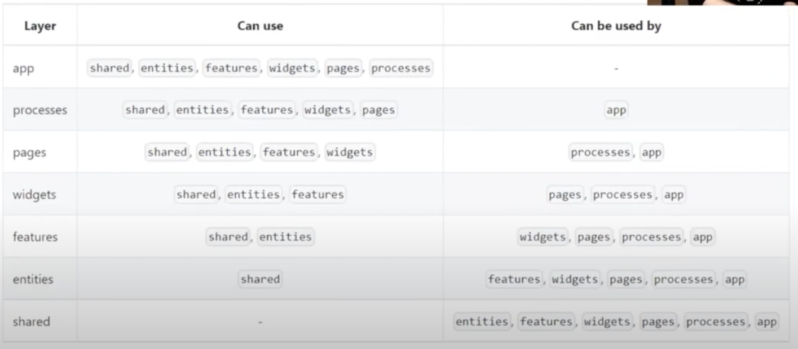
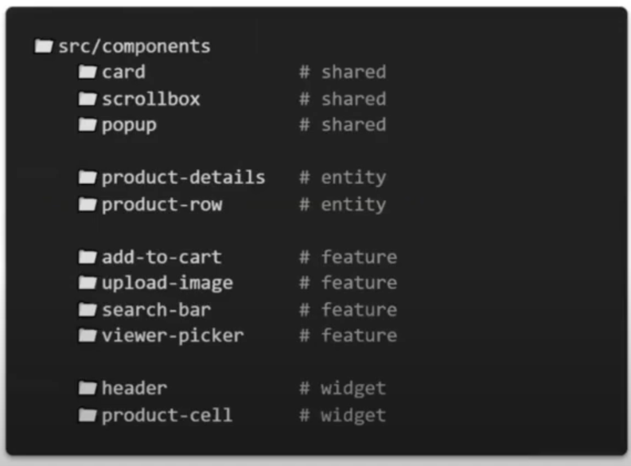
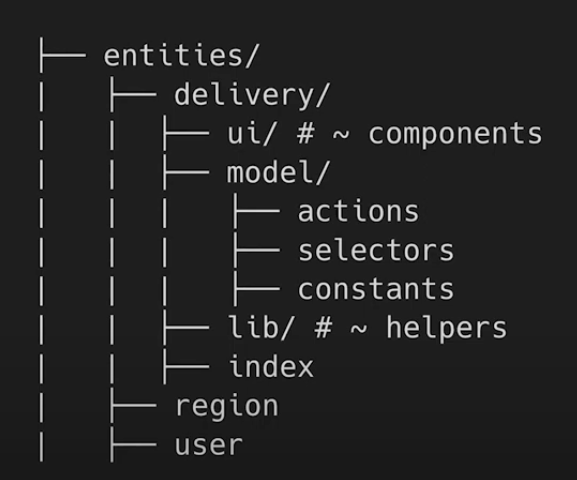
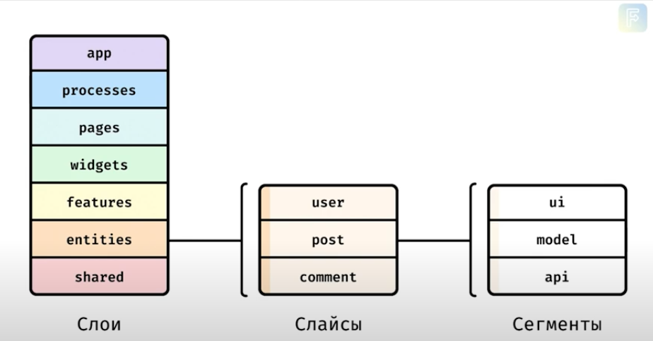m
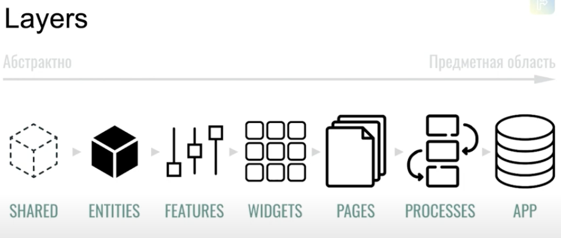
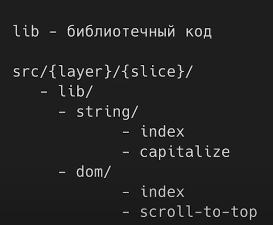
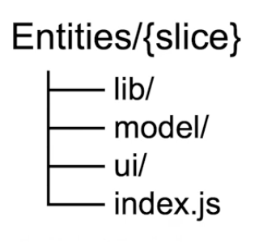
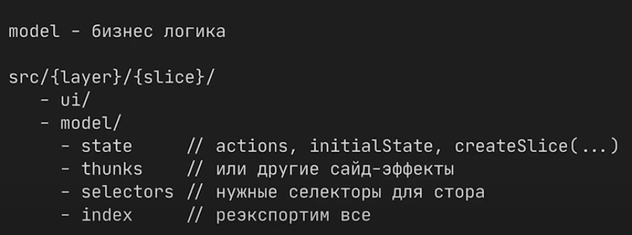
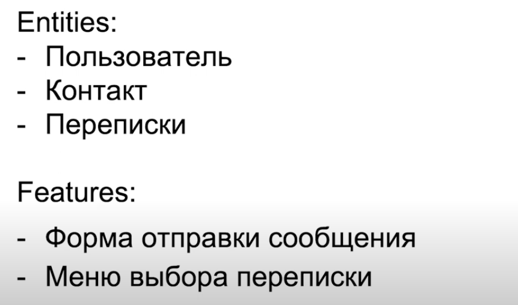
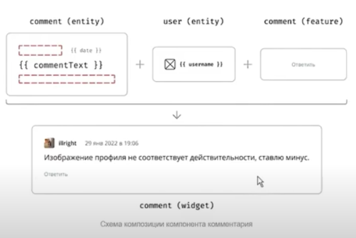
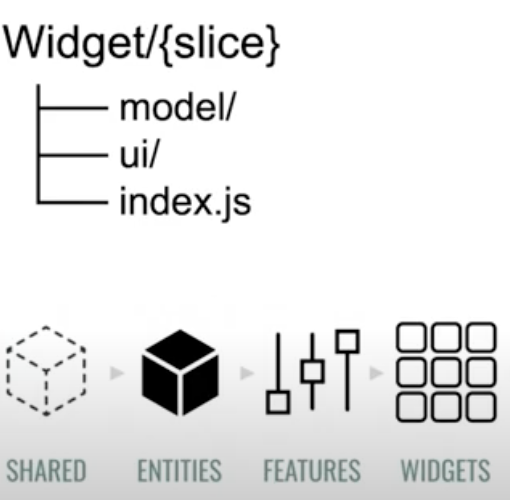
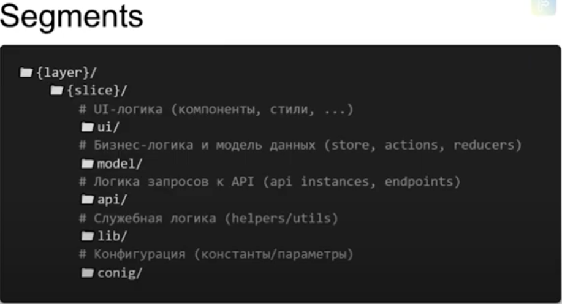
~~~
По уровню знания/ответственности
app > processes > pages > widgets > features > entities > shared
~~~
~~~
По уровню опасности изменений
shared > entities > features > widgets > pages > processes > app
~~~
~~~
└── src/
    ├── app/                    # Инициализирующая логика приложения
    ├── processes/              # (Опц.) Процессы приложения, протекающие над страницами
    ├── pages/                  # Страницы приложения
    ├── widgets/                # Самостоятельные и полноценные блоки для страниц
    ├── features/               # (Опц.) Обрабатываемые пользовательские сценарии
    ├── entities/               # (Опц.) Бизнес-сущности, которыми оперирует предметная область
    └── shared/                 # Переиспользуемые модули, без привязки к бизнес-логике
~~~
~~~
{layer}/
    ├── {slice}/
    |   ├── ui/                     # UI-логика (components, ui-widgets, ...)
    |   ├── model/                  # Бизнес-логика (store, actions, effects, reducers, ...)
    |   ├── lib/                    # Инфраструктурная логика (utils/helpers)
    |   ├── config*/                # Конфигурация (проекта / слайса)
    |   └── api*/                   # Логика запросов к API (api instances, requests, ...)
~~~
~~~
pages/
   ├── order/
   |    ├── cart/
   |    ├── checkout/
   |    |    ├── delivery/
   |    |    └── payment/
   |    ├── result/
   |    └── index.tsx
   ├── auth/
   |    ├── sign-in/
   |    └── sign-up/
   ├── home/
   ├── catalog/
~~~

### Links
 - [FSD-1 manual](https://feature-sliced.design/ru/docs/reference/units/decomposition)
 - [FSD-2 manual](https://feature-sliced.design/ru/docs/get-started/cheatsheet)
 - [Emotion](https://emotion.sh)
 - [React Select](https://react-select.com/home)
 - [Countries API](https://restcountries.com)

### Libs: 